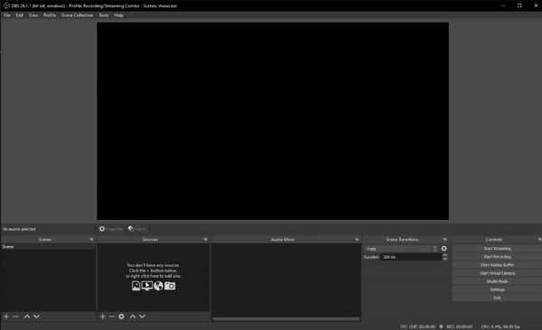

<br />
<p align="center">
  <a href="https://github.com/DavidIlie/obs-youtube-widget">
    
  </a>

  <h3 align="center">OBS Youtube Widgets</h3>

  <p align="center">
    The simplest way to integrate your stats on your stream!
    <br />
    <a href="https://github.com/DavidIlie/obs-youtube-widget/issues">Report Bug</a>
    ·
    <a href="https://github.com/DavidIlie/obs-youtube-widget/issues">Request Feature</a>
  </p>
</p>

## About The Project

From my research (I admit it wasn't that much research), I didn't really find an adequate way to get my youtube statistics and simply to put then in a text file which can be read by any program including OBS for streaming. So as the developer that I am I did just this, the simplest way (from what I found) to put your youtube statistics in your stream like popular twitch streamers do.

Normally, you would need access to the YouTube API in order to get these statistics but that is a long and lengthy process to do this. So I found a website online and I reverse engineered its code (apologies [counts.live](https://counts.live)).

Currently, it fetches data every minute to prevent being rate-limited from this website. Once I find a more better way to fetch the data as close to instantly as possible, I will update this. So make sure to watch the repository for new commits!

## Getting Started

Even though this project is advertised as simple, you still need to run some commands in order to get it running.

To start off you need [NodeJS](https://nodejs.org/en/) installed.

### Prerequisites

This is an example of how to list things you need to use the software and how to install them.

-   Install the dependencies
    ```sh
    npm i
    ```

### Installation

1. Find your YouTube Channel ID. If you don't know how, [click here](https://support.google.com/youtube/answer/3250431?hl=en)

2. Install NPM packages:
    ```sh
    npm install
    ```
3. Enter your Channel ID in `.env` - See example below:
    ```JS
    CHANNEL_ID=UCwfF_jZHkxF1Vxx5b8PlIGA
    ```

## Usage

Once you get everything installed, you can run the application with this command:

```sh
npm run app
```

This will keep the application running in the background and the text files will be inserted into seperate files in `data/`

## Adding into OBS

Now, we're done with the hard stuff. To insert it into OBS please see the GIF below.

<p align="center">
  <a href="https://github.com/DavidIlie/obs-youtube-widget">
    
  </a>
</p>
